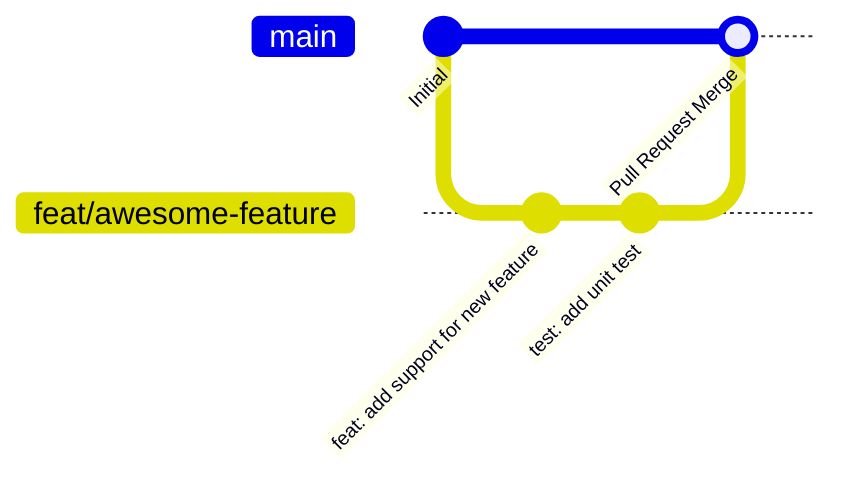

# 星枢终端 (Nexus Terminal) - 贡献指南 (Contributing Guide)

感谢你关注并有意向为星枢终端（Nexus Terminal）做出贡献！开源社区的繁荣离不开每一位开发者的参与。在提交代码或建议前，请花几分钟阅读以下指南。

---

## 1. 行为准则 (Code of Conduct)
- 尊重社区每一位成员，保持友善、包容与建设性的技术探讨。
- 共同维护项目代码质量，遵循统一的技术规范。

---

## 2. 参与流程与分支工作流 (Workflow)



1. **Fork 本仓库** 到你个人的 GitHub 账户。
2. **克隆到本地**：
   ```bash
   git clone https://github.com/<your-username>/nexus-terminal.git
   cd nexus-terminal
   ```
3. **基于 `main` 创建特性分支**：
   ```bash
   # 新特性分支
   git checkout -b feat/your-feature-name
   # 缺陷修复分支
   git checkout -b fix/issue-description
   ```
4. **进行开发与本地验证**：参考 [本地开发指南](doc/DEVELOPMENT.md) 进行环境搭建与自测。
5. **提交代码 (Git Commit)** 并推送分支到你的远程 Fork 仓库。
6. **创建 Pull Request**：详细描述改动的背景、实现思路与测试情况。

---

## 3. Git 提交信息规范 (Conventional Commits)

本项目强制推荐遵循 [Conventional Commits](https://www.conventionalcommits.org/) 规范，提交消息格式如下：

```text
<type>(<scope>): <subject>
```

### 常用类型说明 (`type`)
- `feat`: 新增业务功能
- `fix`: 修复已知缺陷 (Bug)
- `docs`: 文档变更（如补充 API 手册、架构图、README）
- `style`: 代码格式变动（空格、格式化、不影响代码逻辑）
- `refactor`: 代码重构（既不新增功能，也不修复 Bug）
- `perf`: 性能调优
- `test`: 增加或修改测试用例
- `chore`: 构建过程、辅助工具或依赖项变动

### 提交示例
- `feat(ssh): 支持终端窗口右键复制粘贴配置项`
- `fix(sftp): 修复深度目录递归打包下载时的内存溢出问题`
- `docs(api): 更新 WebSocket 握手协议说明`

---

## 4. 代码风格与编写规范

1. **语言与类型安全**：
   - 全面使用 TypeScript 进行开发，尽量避免使用 `any` 类型。
   - 前端采用 Vue 3 Composition API (`<script setup lang="ts">`)。
2. **注释规范**：
   - 复杂业务逻辑与算法请添加清晰的中文注释。
3. **敏感凭证防泄漏**：
   - 严禁将真实的生产密码、私钥、域名或密钥硬编码到任何提交的代码或测试用例中。
